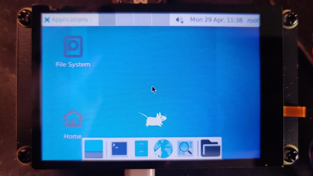
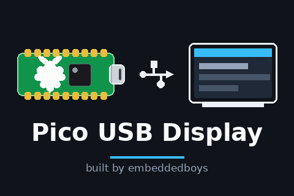

Pico USB Display
============================

[中文](./README.md) | [English](./README.en.md)

Have you ever considered using your Pico board as a display device?
If not, you might be interested in this project.

<!-- (put a preview video here) -->

https://github.com/user-attachments/assets/9541297a-1a50-4cca-b3d9-013d84244e89

https://github.com/user-attachments/assets/7fa16b4b-5ea4-4122-a23e-d53f6be5380d



## Features

- 🚀 Easy to use (A Pico board and TFT Display with some jumper wires)
- 📦 Supports multiple platforms (Linux, Windows, macOS)

## How to?

Hardware requirements

- Raspberry Pi Pico
- 1 x SPI or I8080 TFT display, [here]() a list of compatible driver

### Setup your Pico board

Go to the Github Release page and download the prebuilt firmware uf2 file.

Also, If you want to compile the firmware yourself (Assuming you are using a Ubuntu machine)

#### 1. Install the [Pico SDK](https://github.com/raspberrypi/pico-sdk)

```bash
git clone https://github.com/raspberrypi/pico-sdk.git ~/pico-sdk
cd ~/pico-sdk
git submodule update --init
```

#### 2. Install CMake (at least version 3.13), python 3, a native compiler, and a GCC cross compiler

```bash
sudo apt install cmake python3 build-essential gcc-arm-none-eabi libnewlib-arm-none-eabi libstdc++-arm-none-eabi-newlib ninja-build
```

#### 3. Clone this repo

```bash
git clone https://github.com/embeddedboys/Pico-USB-Display.git
cd Pico-USB-Display
```

#### 4. Select the panel config you need

The configs live in this repository's `configs/` directory (one `.cmake` per panel,
pin definitions included); pick one with `lunch`:

```bash
./build.sh configs      # list them first (panel / bus / resolution / touch)
./build.sh lunch        # pick the board (pico / pico2) and the panel config
```

Enter keeps the current value; the choice is remembered in `.pud-config` (not
committed) and every later `./build.sh` follows it. To override it once:

```bash
./build.sh -b pico2 -c generic-st7789v
```

#### 5. Then build the firmware
```bash
./build.sh              # configure + build; board pico2 builds into build-pico2/
```
```text
[82/84] Linking CXX executable pico-usb-display.elf
Memory region         Used Size  Region Size  %age Used
           FLASH:      256700 B         2 MB     12.24%
             RAM:      163604 B       256 KB     62.41%
       SCRATCH_X:          2 KB         4 KB     50.00%
       SCRATCH_Y:          2 KB         4 KB     50.00%
[84/84] Print target size info
      text       data        bss      total filename
     98328     158372      32792     289492 pico-usb-display.elf
```

You can find the firmware in the `build-pico2` (or `build`) directory.

#### 6. Copy the udev rules to `/etc/udev/rules.d/`

If you don't want to access USB devices with root privileges, then you need to configure udev rules correctly.
```bash
sudo cp 60-pico-usb-display.rules /etc/udev/rules.d/

# Then reload the udev rules
sudo udevadm control --reload-rules && sudo udevadm trigger
```

#### 7. Flash the firmware to your Pico board

`lunch` also picks the flash method, so one command flashes what was just built
(`none` = drag the uf2 yourself):

```bash
./build.sh flash                # flash with the method lunch remembered
./build.sh flash -n             # print the command line only
./build.sh flash -m openocd     # use another method once
```

The methods are `picotool` (BOOTSEL over USB), `openocd` (CMSIS-DAP on this
machine), `gdb` (an already running GDB server, e.g. OpenOCD on the Windows
host) and `blackmagic` (Black Magic Probe); see
[`notes/build-and-flash.md`](./notes/build-and-flash.md) for what has been
verified on hardware.

Or flash by hand: Pico has provided a bootloader that can easily flash the firmware to the Pico board. Hold the `BOOTSEL` button while plugging in the Pico board, and a drive named `RPI-RP2` or `RP2350` will be mounted. Then you can copy the `pico-usb-display.uf2` file to the drive and the firmware will be flashed to the Pico board.

Once the firmware flashing is complete, you will see some content displayed on the screen. Here is an example：



### Display Pictures and videos

If you don't want to hack, then a Python script is the simplest way to use it, but DRM driver or other methods (in the future) are more effcient.

#### Python script

create a python3 venv and install requierments

```bash
python3 -m venv .venv
source .venv/bin/activate

pip install pyusb Pillow numpy     # numpy is only needed by codec_compare/fps_bench/check_pudcodec
```

If you want to show a picture on pico display:
```bash
# Usage: ./tools/img_viewer.py [--xres N] [--yres N] <file.jpg>

./tools/img_viewer.py --xres 480 --yres 320 ~/Pictures/artplayer_19_21.png
```

Or you want to play a video on the pico display:
```bash
# Usage: ./tools/video_player.py [--xres N] [--yres N] [--fps N] [--codec qoi|rle|lz4] <video.mp4>

./tools/video_player.py --xres 480 --yres 320 --fps 15 ~/Videos/jazz_15fps.mp4
```

You probably also want to know how to set the video to 15fps:
```bash
ffmpeg -i ./jazz.mp4 -vf "fps=15" -c:v libx264 -preset fast -crf 23 -c:a copy ./jazz_15fps.mp4
```

#### Kernel driver

```bash
git clone https://github.com/embeddedboys/PUD-kernel-drivers
cd PUD-kernel-drivers

make
sudo insmod pud.ko
```

Then you can easily play the video using the following command:

```bash
ffplay ./jazz.mp4
```

## Developer documentation

Design notes and pitfall write-ups for maintainers live in [`notes/`](./notes/):

- [Architecture and boot flow](./notes/architecture.md)
- [USB protocol (device side)](./notes/usb-protocol.md)
- [Decoders and frame pipeline](./notes/decoders.md) (incl. EP1 flow control)
- [Build and flash](./notes/build-and-flash.md)
- [Debugging](./notes/debugging.md)
- [Userspace tools](./notes/scripts.md)
- [Pitfalls](./notes/pitfalls.md)

## Open source software used

- [FreeRTOS-Kernel](https://github.com/FreeRTOS/FreeRTOS-Kernel)
- [bitbank2/JPEGENC](https://github.com/bitbank2/JPEGENC)
- [bitbank2/JPEGDEC](https://github.com/bitbank2/JPEGDEC)
- [dgatf/usb_library_rp2040](https://github.com/dgatf/usb_library_rp2040)
- [cherry-embedded/CherryUSB](https://github.com/cherry-embedded/CherryUSB)
- [Bodmer/TJpg_Decoder](https://github.com/Bodmer/TJpg_Decoder)
- [rgb565-qoi](https://github.com/embeddedboys/rgb565-qoi)
- [rgb565-rle](https://github.com/embeddedboys/rgb565-rle)
- [ChaN/TJpgDec](http://elm-chan.org/fsw/tjpgd/00index.html)
- [embeddedboys/pico_dm_qd3503728_freertos](https://github.com/embeddedboys/pico_dm_qd3503728_freertos)

## Links

- [PUD-kernel-drivers - A drm driver for Pico USB Display](https://github.com/embeddedboys/PUD-kernel-drivers)
