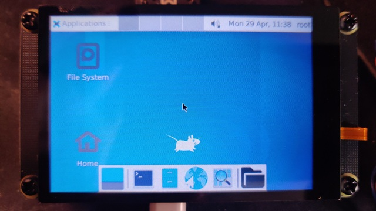

Pico USB Display
============================

Have you ever considered using your Pico board as a display device?
If not, you might be interested in this project.

<!-- (put a preview video here) -->



## Features

- 🚀 Easy to use (A Pico board and TFT Display with some jumper wires)
- 📦 Supports multiple platforms (Linux, Windows, macOS)

## How to?

Hardware requirements

- Raspberry Pi Pico
- 1 x SPI or I8080 TFT display, [here]() a list of compatible driver

### Setup your Pico board

Go to the Github Release page and download the prebuilt firmware uf2 file.

Also, If you want to compile the firmware yourself (Assuming you are using a Ubuntu machine)

#### 1. Install the [Pico SDK](https://github.com/raspberrypi/pico-sdk)

```bash
git clone https://github.com/raspberrypi/pico-sdk.git ~/pico-sdk
cd ~/pico-sdk
git submodule update --init
```

#### 2. Install CMake (at least version 3.13), python 3, a native compiler, and a GCC cross compiler

```bash
sudo apt install cmake python3 build-essential gcc-arm-none-eabi libnewlib-arm-none-eabi libstdc++-arm-none-eabi-newlib ninja-build
```

#### 3. Clone this repo

```bash
git clone https://github.com/embeddedboys/Pico-USB-Display.git
cd Pico-USB-Display
```

#### 3. Select the config you need, open `CMakeLists.txt` and :

==You can find the pin definitions in the configuration file.==

```cmake
# **********  select the suitable config file  **********
include(${PICO_DISPLAY_LIB_CONFIG_PATH}/pico_dm_qd3503728.cmake)
# include(${PICO_DISPLAY_LIB_CONFIG_PATH}/pico_dm_qd3503728_8bit.cmake)
# include(${PICO_DISPLAY_LIB_CONFIG_PATH}/pico_dm_yt350s006.cmake)
# include(${PICO_DISPLAY_LIB_CONFIG_PATH}/generic-ili9341.cmake)
# include(${PICO_DISPLAY_LIB_CONFIG_PATH}/generic-st7789v.cmake)
```

#### 4. Then build the firmware
```bash
mkdir -p build && cd build
cmake .. -G Ninja
ninja
```
```text
[82/84] Linking CXX executable pico-usb-display.elf
Memory region         Used Size  Region Size  %age Used
           FLASH:      256700 B         2 MB     12.24%
             RAM:      163604 B       256 KB     62.41%
       SCRATCH_X:          2 KB         4 KB     50.00%
       SCRATCH_Y:          2 KB         4 KB     50.00%
[84/84] Print target size info
      text       data        bss      total filename
     98328     158372      32792     289492 pico-usb-display.elf
```

You can find the firmware in the `build` directory.

#### 5. Copy the udev rules to `/etc/udev/rules.d/`

If you don't want to access USB devices with root privileges, then you need to configure udev rules correctly.
```bash
sudo cp 50-pico-usb-display.rules /etc/udev/rules.d/

# Then reload the udev rules
sudo udevadm control --reload-rules && sudo udevadm trigger
```

#### 6. Flash the firmware to your Pico board

Pico has provided a bootloader that can easily flash the firmware to the Pico board. Hold the `BOOTSEL` button while plugging in the Pico board, and a drive named `RPI-RP2` or `RP2350` will be mounted. Then you can copy the `pico-usb-display.uf2` file to the drive and the firmware will be flashed to the Pico board.

Once the firmware flashing is complete, you will see some content displayed on the screen. Here is an example：


### Display Pictures and videos

If you don't want to hack, then a Python script is the simplest way to use it, but DRM driver or other methods (in the future) are more effcient.

#### Python script

create a python3 venv and install requierments

```bash
python3 -m venv .venv
source .venv/bin/activate

pip install pyusb opencv-python numpy
```

If you want to show a picture on pico display:
```bash
# Usage: ./scripts/img_viewer.py [xres] [yres] <file.jpg>

./scripts/img_viewer.py 480 320 ~/Pictures/artplayer_19_21.png
```

Or you want to play a video on the pico display:
```bash
# Usage: ./scripts/video_player.py [xres] [yres] [quality|1-100] <video.mp4>

./scripts/video_player.py 480 320 50 ~/Videos/jazz_15fps.mp4
```

You probably also want to know how to set the video to 15fps:
```bash
ffmpeg -i ./jazz.mp4 -vf "fps=15" -c:v libx264 -preset fast -crf 23 -c:a copy ./jazz_15fps.mp4
```

#### Kernel driver

```bash
git clone https://github.com/embeddedboys/PUD-kernel-drivers
cd PUD-kernel-drivers

make
sudo insmod pud.ko
```

Then you can easily play the video using the following command:

```bash
ffplay ./jazz.mp4
```

## Links

- [PUD-kernel-drivers - A drm driver for Pico USB Display](https://github.com/embeddedboys/PUD-kernel-drivers)
